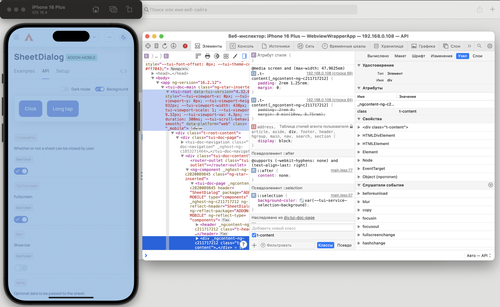

## WebView wrapper for testing app on iOS

1. Open project in Xcode
2. Insert your URL in [ViewController](./WebviewWrapperApp/ViewController.swift#L22)
3. Build project and see simulation (opened automatically after successfully build)
4. Open Safari Web Inspector for debug
5. Testing

